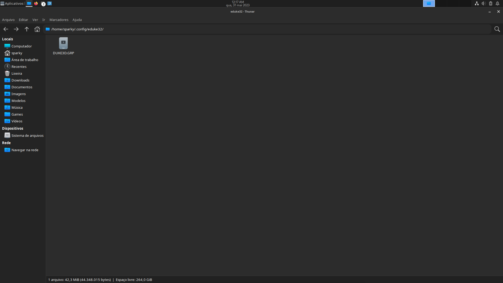

# About 

  

This is a `AppImage` version of **Eduke32** that was maded to click and run *without the need to install or compile*.

## Note

You need to put a file of Duke Nukem 3D PC game called **"DUKE3D.GRP"** on the `~/.config/eduke32/` folder that is *generated when starting the program*.

This is a AppImage version of Eduke32 that was maded to click and run without the need to install or compile.

## Usage 

Copy the **DUKE3D.GRP** from the ***~/.config/eduke32***

### For more information, see the [Wiki](https://wiki.eduke32.com/wiki/Main_Page)

