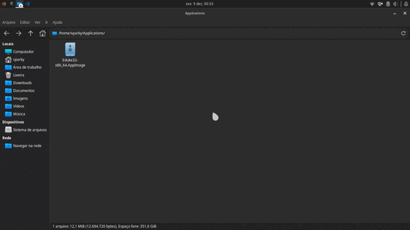

# About 

This is a `AppImage` version of **Eduke32** that was maded to click and run *without the need to install or compile*.

## Note

You need to put a file of Duke Nukem 3D PC game called **"DUKE3D.GRP"** on the `~/.config/eduke32/` folder that is *generated when starting the program*.
